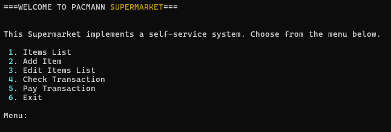

# Simple POS - Python Project
---

* ## A. Background
  POS or Point Of Sales is a system where customer makes a payment for goods or services. 

  In this simple python project, the goal is to create a program for self-service purchasing.

  
* ## B. Requirements
  To create and run this system with python, you need to install two module:

  1. tabulate
  2. rich 
   
  to install both module using pip, simply enter the following command in your terminal:
  ```
  pip install tabulate rich
  ```

* ## C. Objectives
  Learning objective from this project:
  - Create simple POS in python
  - Implementing python material from Pacmann, Basic Python and Python for Engineering
  - Implementing PEP8 principles to write clean python program.

  Program objective:
  - Create transaction class
  - Showing items list that customer can purchase
  - Adding items that customer want to purchase
  - Editing customer's items list
  - Checking total transaction

* ## D. Flowchart

  The flowchart for the POS system is shown below.

  

* ## E. Class, Method, and Functions
  
  The classes, methods, and functions used in this program are explained below.

  
  
  
